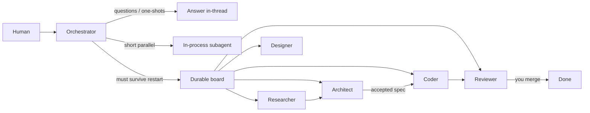

# Spec: Workstation agent fleet

**Feature ID**: 008-workstation-agent-fleet
**Status**: Living — this is how the DGX Spark workstation is actually run
**Created**: 2026-08-18
**Published**: 2026-08-20
**Owner**: Derek Clair

Companion hardware path: [`conversational-voice-agent`](https://github.com/derekclair/conversational-voice-agent)
(Lenovo Go spoken I/O; this repo is the LangGraph brain).

This spec is a public, scrubbed write-up of the workstation’s agent operating
design. It is not a dump of local tool config. Secrets, chat IDs, home
directory paths, and unpublished-company framing stay out of git.

---

## Overview

A single human talks to **one** front-door agent. That orchestrator either
answers, or it decomposes work onto a **durable board** with specialist
roles (architect, researcher, coder, designer, reviewer). The LangGraph
package in this repo is the memory-aware *reasoning* brain used by the
spoken path and by text chat. The fleet around it is how non-trivial
work is specified, implemented, and reviewed on a memory-limited
NVIDIA DGX Spark.

The hard design problem is not “call an LLM.” It is: **which work is
ephemeral, which work must survive a restart, who is allowed to write
code, and what can actually run on one GB10 without swapping two large
models.**

---

## Mental model

```
Human ──► orchestrator (front door)
              │
              │  durable cards (only real roles)
              ▼
   ┌──────────┼──────────┬────────────┬──────────┐
   │          │          │            │          │
architect  researcher  coder      designer  reviewer
(specs)    (sources)   (impl+PR)  (UI)      (gate)
```

| Layer | What it is | When to use |
|-------|------------|-------------|
| **Conversation** | Front-door profile (CLI) | Questions, decisions, small one-shot work |
| **In-process subagent** | Child task inside the current turn | Short parallel reasoning; dies with the parent |
| **Durable board** | SQLite (or similar) cards + specialist workers | Specs, multi-lane work, review, anything a human might inspect, pause, or resume |

Rule of thumb: if a human might want to inspect, pause, or resume it later
→ **board**. If it is a two-minute sub-question → answer in the conversation
or spawn an in-process subagent.



---

## Roster (real roles only)

Unknown assignees sit in `ready` forever. Do not invent role names at
dispatch time.

| Role | Allowed to | Not allowed to |
|------|------------|----------------|
| **Orchestrator** | Talk to the human, decompose, dispatch | Skip the spec gate on non-trivial work |
| **Architect** | Specs, architecture, plans | Product code |
| **Researcher** | Sources, comparisons, findings | Product code |
| **Coder** | Implement an *accepted* spec; branch, tests, PR | Speculative redesign while implementing |
| **Designer** | UI / visual artifacts | Backend ownership |
| **Reviewer** | Block or approve | Implement the fix |
| **Voice path** | Spoken I/O on the Lenovo Go (this lab’s hardware spike) | Replace the brain |

Quality-critical roles (orchestrator, architect, reviewer, design) use a
hosted frontier model so they do not fight the local VRAM slot. Local
workers (coder, researcher) use a ~30B-class model on the Spark with a
hosted fallback if local dies or times out.

---

## Hardware / local model reality (DGX Spark)

- **GB10**, ~128 GB unified CPU+GPU memory, bandwidth-limited (~273 GB/s).
- **One serious local LLM at a time.** A second large model fills memory.
- Agent loops stay in the **~30B class**. No 120B+ agent loops on this box.
- The spoken path (`conversational-voice-agent`) keeps STT on CPU
  (Parakeet TDT 0.6B) and TTS on CPU (Piper) so the GPU slot can stay
  with the worker LLM or stay free.
- This repo’s `LLM_PROVIDER=openai_compatible` path is how a local NIM
  or Ollama endpoint becomes the brain without an OpenAI SDK.

These constraints are why the fleet splits *roles* instead of running
one giant local agent that tries to spec, code, and review in a single
context window.

---

## SDD gate (always, for non-trivial work)

1. **Spec** (architect) with acceptance criteria
2. **Human review** — accept or request changes
3. **Implement** (coder) on a feature branch
4. **Review** (reviewer) — block or approve
5. **Human merge** — work is only “done” when merged

No product code before an accepted spec.

### Standard pipelines

**Spec → implement → review**

```
architect (spec, durable dir or worktree)
       │
       ▼
  [human accept]
       │
       ▼
coder (impl, worktree) ──► reviewer ──► human merge
```

**Research-heavy**

```
researcher (lane A)  ─┐
researcher (lane B)  ─┼─► architect (synthesize) ─► coder ─► reviewer
```

**Design + build**

```
designer ─┐
architect ─┴─► coder ─► reviewer
```

Children stay blocked until parents are done.

---

## Who owns the request

| Request | Owner |
|---------|--------|
| “What should we build / how?” | Architect (spec) → human review |
| “Look up X / compare options” | Researcher |
| “Implement the accepted spec” | Coder |
| “Make it look good / DESIGN.md” | Designer |
| “Is this safe/correct to merge?” | Reviewer |
| “Quick question / small edit” | Orchestrator (no board) |
| Mix of the above | Orchestrator decomposes → board |

---

## Workspace rules

| Kind | Use for | Survives complete? |
|------|---------|-------------------|
| Scratch | Throwaway probes | **No** |
| Durable directory | Specs, docs | Yes |
| Git worktree | Code changes | Yes |

Never put a durable deliverable on scratch. Workers must **complete** or
**block** with a concrete artifact (paths, PR URL, test counts). Clean
exit without either is a protocol violation. No secrets in board fields.

---

## Failure modes (the ones that actually happened)

| Symptom | Likely cause | Fix |
|---------|--------------|-----|
| Card stuck `ready` | Unknown role name, or dispatcher down | Only dispatch to the roster; restart the orchestrator |
| Protocol violation / auto-blocked | Worker exited without complete/block | Reclaim the card; tighten the role instructions |
| Local worker useless | Local server down / wrong model / no fallback | Check the local OpenAI-compatible endpoint; keep hosted fallback |
| Spec vanished after “done” | Scratch workspace | Durable dir or worktree for artifacts |
| Long local timeouts | Tool loops on a small local model | Smaller task body; hosted model for orchestration |
| Memory full on Spark | Two big models at once | One local model; no 120B+ agent loops |

---

## Mapping to this lab’s code

| Piece | Where it lives |
|-------|----------------|
| Memory-aware LangGraph brain | `src/thelab_langchain/agent/` (this repo) |
| Provider factory (Grok / Claude / local NIM) | `src/thelab_langchain/llm.py` |
| Spoken ears/mouth/hands | [`conversational-voice-agent`](https://github.com/derekclair/conversational-voice-agent) |
| Voice hardware spike spec | `specs/001-voice-dgx-spark-agent/` |
| DGX hardware / 30B-class constraint | `specs/007-dgx-hardware-optimization/` |
| Current fleet runtime | Hermes Agent profiles on this workstation (config stays local; this spec is the design) |

The runtime is an implementation detail. The design that is worth
showing is the **role split, the spec gate, and the Spark memory
budget**.

---

## Non-goals

- Publishing local profile configs, OAuth tokens, or chat/channel IDs
- Treating this spec as a productized multi-tenant “agent OS”
- Running the architect or reviewer as the implementer
- Dual-running two dispatchers against the same board
- 120B+ local agent loops on a single Spark
